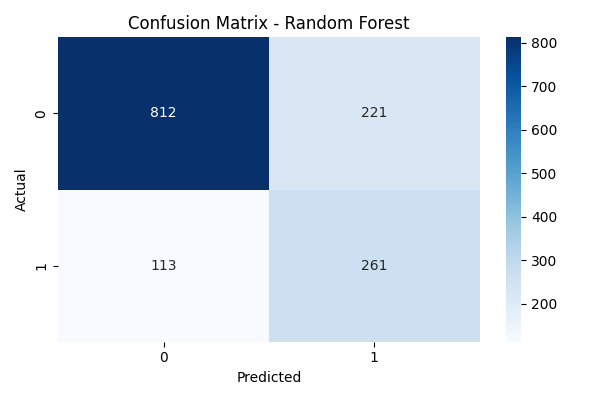
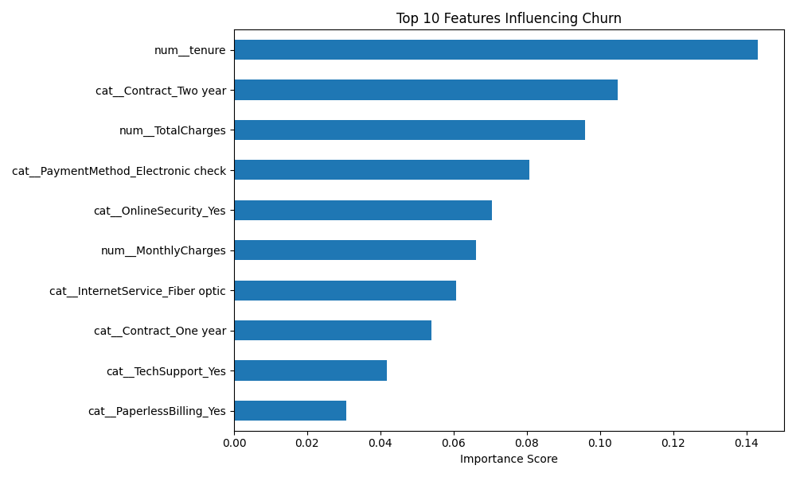

## Customer Churn Prediction

## 📌 Problem Statement
Predict customers likely to churn in a telecom dataset to help businesses improve customer retention.

---

## ⚙️ Tech Stack
- Python
- Pandas, NumPy
- Scikit-learn
- Imbalanced-learn (SMOTE)
- Matplotlib, Seaborn

---

## 🧠 Approach
- Data cleaning and preprocessing
- Feature scaling and encoding
- Handling class imbalance using SMOTE
- Random Forest model with hyperparameter tuning (GridSearchCV)
- Model evaluation using F1-score and ROC-AUC

---

## 📊 Results
- ROC-AUC Score: **0.83**
- Recall (Churn): **70%**
- Accuracy: **76%**

---

## 📈 Key Insights
- Customers with month-to-month contracts are more likely to churn
- Low tenure customers are at high risk
- Higher monthly charges increase churn probability
- Certain payment methods show higher churn behavior

---

## 📷 Visualizations

### Confusion Matrix

### Feature Importance

---

## 🚀 Project Highlights
- Built an end-to-end ML pipeline
- Applied SMOTE to handle imbalanced data
- Tuned model using GridSearchCV
- Extracted business insights from feature importance
